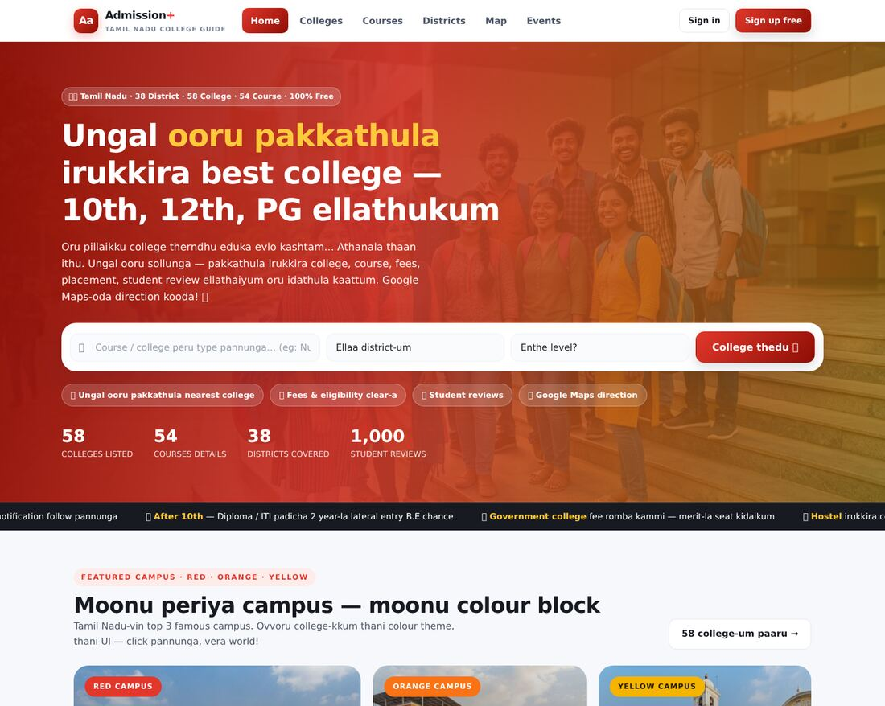
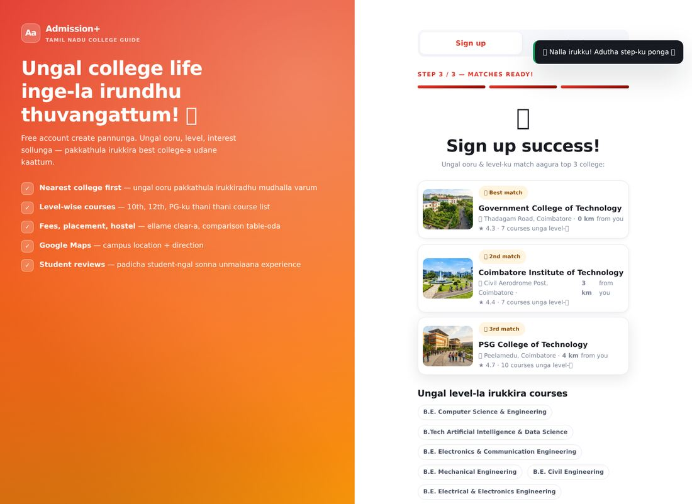
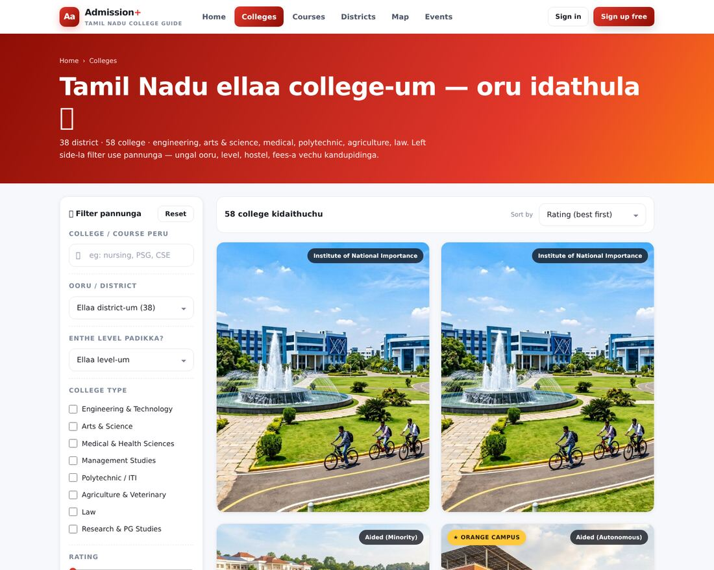
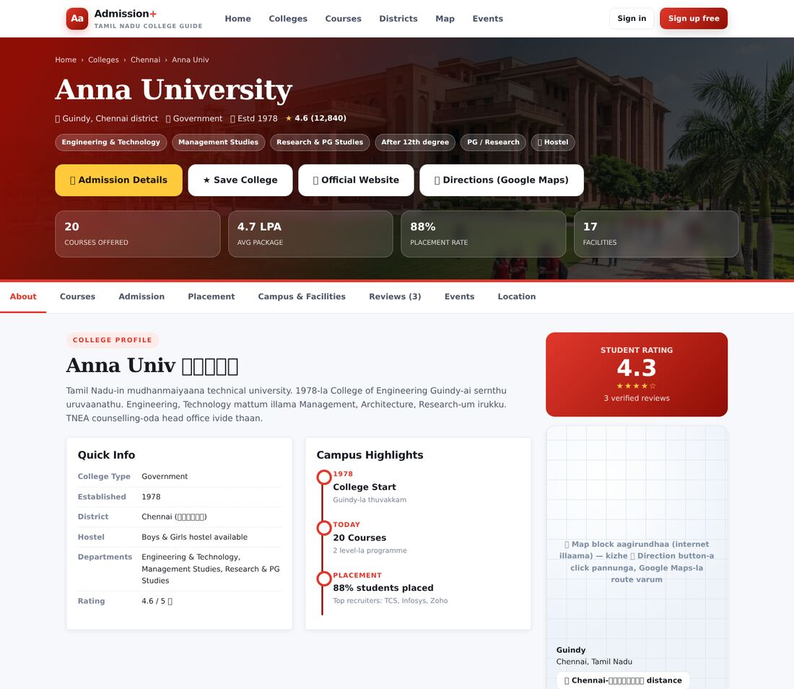
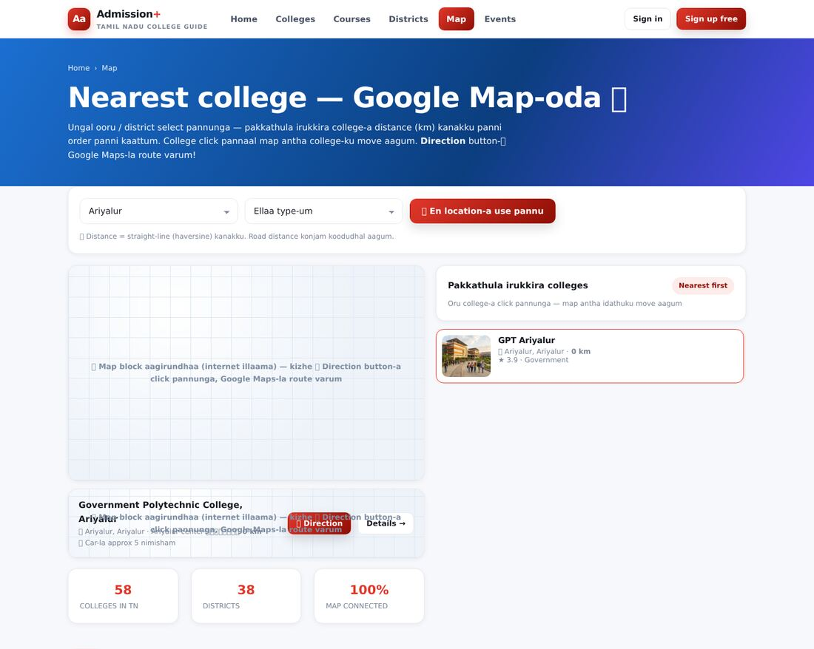
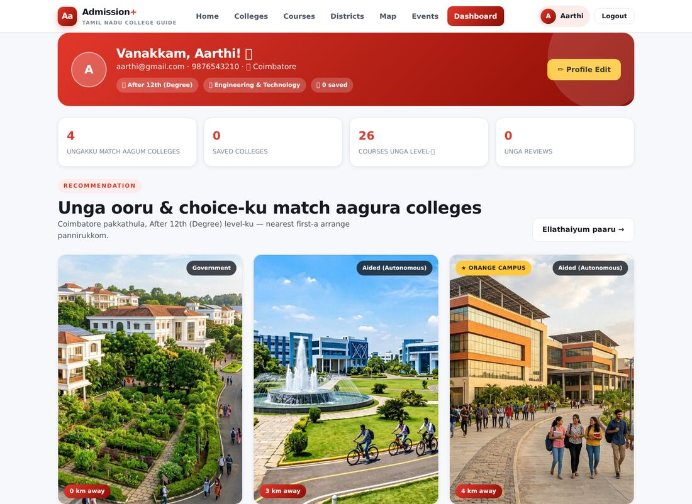
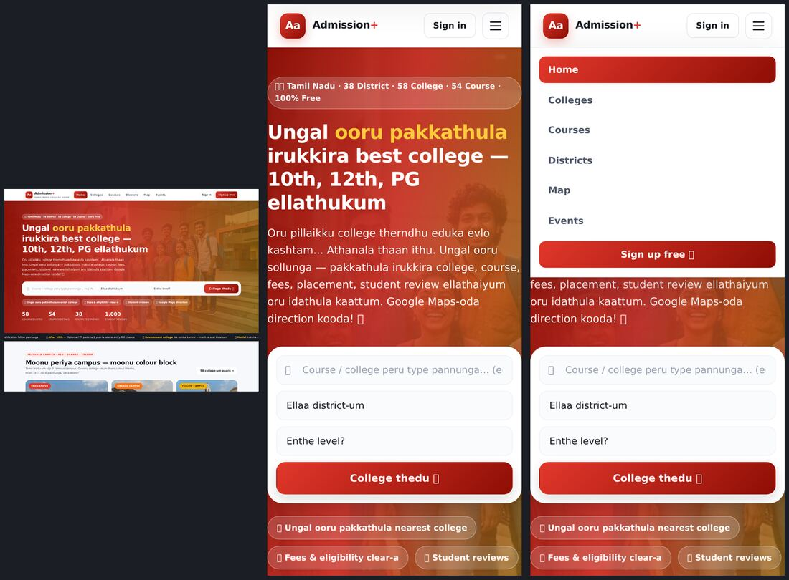

# 🎓 Admission+ — Tamil Nadu Education Research Portal

> **Ungal ooru pakkathula irukkira best college-a kandupidikka oru website.**
> 10th mudicha pillaikku diploma · 12th mudicha pillaikku degree · UG mudicha pillaikku PG —
> ellathaiyum oru idathula, fees + placement + student review + Google Map-oda.

Idhu **HTML + CSS + JavaScript mattum** (framework illa) — so VS Code-la open panni udane run aagum.
Database-um **browser-la thaan** (localStorage) — server edhuvum theva illa.

---

## ✅ Mudhalla ithai paarunga (2 nimisham)

| # | Neenga panna vendiyathu | Eppadi |
|---|------------------------|--------|
| 1 | Website-a open panna | **`index.html`** file-a double-click pannunga (illa VS Code-la Live Server) |
| 2 | Signup panna | Home page-la **Sign up free** → peru, email, phone, password → next → **ooru + level** (10th/12th/PG) → submit |
| 3 | Match paaru | Signup mudicha udane **pakkathula irukkira top 3 college** distance-oda kaattum |
| 4 | College paarunga | **Colleges** menu → filter → college card click → full details (courses, fees, placement, review, map) |
| 5 | Map paarunga | **Map** menu → district select → list-la college click → map move aagum → **🧭 Direction** → Google Maps route |

> ⚠️ **Local server use pannunga** (recommended). Chinna problem: `file://`-la open pannaa browser
> sometimes localStorage block pannum (appuram signup save aagaadhu). So ithu pannunga:
>
> ```bash
> # Project folder-la irundhu (terminal-la)
> python3 -m http.server 8000
> # appuram browser-la:  http://localhost:8000/index.html
> ```
> Illainaa VS Code-la **Live Server** extension install panni `index.html` → right click → *Open with Live Server*.

---

## 📁 Folder & File structure (ovvoru file enna panuthu?)

```
Admission-/
│
├── index.html          ⭐ MUDHAL PAGE ITHU THAAN (home page)
│                       Hero search, 3 featured college (red/orange/yellow), level cards,
│                       popular courses, "ungal ooru pakkathula" nearby college, counselling guide, events, reviews
│
├── signup.html         📝 Signup page (3 step)
│                       Step 1: peru/email/phone/password → Step 2: ooru + level + interest
│                       → Step 3: pakkathula irukkira top 3 college (automatic-a kanakku pannum)
│
├── login.html          🔐 Login page (email + password). "Demo account details fill pannu" button-um irukku.
│
├── colleges.html       🏫 ELLAA COLLEGE-um ORU IDATHULA (58 college)
│                       Left side filter: district, level (10th/12th/PG), college type, rating, fees, hostel
│                       Sort: rating / nearest / fees / old / A-Z. Compare & Save button-um inge.
│
├── college.html        🎨 ORU COLLEGE-ODA FULL PAGE (ovvoru college-kkum THANI UI!)
│                       About · Courses · Admission process · Placement · Facilities · Gallery ·
│                       Student reviews · Events · Google Map location · pakkathu college
│                       (Use: college.html?id=psg-tech  — id-a maathunga, vera college varum)
│
├── courses.html        📘 54 COURSE-um oru list-la (level tabs: 10th / 12th / PG)
│                       Innum oru super feature: **marks % podunga → eligible course kaattum**
│
├── course.html         📗 ORU COURSE-ODA FULL DETAIL (eligibility, fees, salary, job role,
│                       + intha course-la entha entha college irukku list)
│                       (Use: course.html?id=bsc-nursing)
│
├── districts.html      🗺️ Tamil Nadu 38 DISTRICT (North / Central / South region filter)
│                       District click pannaa antha district college list + map
│
├── map.html            📍 NEAREST COLLEGE MAP — district select pannaa distance (km) order-la college list,
│                       click pannaa Google Map antha college-ku move aagum, direction button-um irukku
│
├── events.html         🎉 COLLEGE EVENTS — cultural fest, technical symposium, sports meet, convocation
│                       + 2026 month-wise event calendar
│
├── dashboard.html      🎯 STUDENT DASHBOARD (login pannina mattum)
│                       Profile, recommendation, saved college list, career checklist, edit profile
│
├── compare.html        ⇄ COLLEGE COMPARE — 2-3 college-a side-by-side table-la compare
│
├── css/
│   └── style.css       🎨 ELLAA DESIGN-UM ITHU THAAN
│                       Colours, buttons, cards, navbar, footer, themes, mobile responsive
│                       (Edhuvum colour maathanumna → file-oda mela `:root { --c1: ... }` maathunga)
│
├── js/
│   ├── data.js         🗄️ "DATABASE" FILE — college, course, district, review data ellame inge
│   │                   • DISTRICTS  (38 district + latitude/longitude)
│   │   • COURSES    (54 course — level, eligibility, fees, salary, job)
│   │   • COLLEGES   (58 college — district, type, rating, map location, theme colour)
│   │   • PLUS: distance kanakku (Haversine), search, facilities, placement, reviews
│   │
│   └── app.js          🧠 WEBSITE-ODA "BRAIN" — ellaa vela-um ithu thaan pannuthu
│                       navbar/footer build, search & filter, sorting, save, compare,
│                       signup/login, review ezhutha, map embed, dashboard, toast, modal
│
├── images/
│   ├── hero-students.jpg      Home page hero banner
│   ├── colleges/              5 campus photos (campus-red / orange / yellow / blue / green)
│   ├── events/                4 event photos (culturals, sports, graduation, techfest)
│   └── programmes/            6 course photos (engineering, arts, medical, business, diploma, pg)
│
└── README.md           📖 Neenga ippo padikkirathu 🙂
```

**Mukkiyamana 3 file mattum gnabagam vainga:**

| File | Enna panuthu | Eppo thodanum |
|------|--------------|----------------|
| `index.html` | Design / page content | Page-la text add panna |
| `js/data.js` | College & course data | **Pudhu college/course add panna (ithu thaan main!)** |
| `css/style.css` | Colour & design | Colour, font, shape maathaa |

---

## ➕ Pudhu college add panna eppadi? (2 nimisham)

1. `js/data.js` file-a open pannunga.
2. `const COLLEGES = [`  nu start aagura list-a kandupidinga.
3. Last college-oda `}` mudinja idathula, oru **comma** pottu ithu pola add pannunga:

```js
{ id:"my-college",                       // unique id (English, hyphen use pannunga)
  name:"My New College of Arts & Science",
  short:"My College",
  district:"Madurai",                    // DISTRICTS list-la irukura peru-a thaan podanum!
  area:"Thirunagar",
  type:"Private (Autonomous)",           // Government / Aided / Private / Deemed / State University
  estd:1998, rating:4.3, reviews:320,    // rating 0-5
  lat:9.9190, lng:78.1230,               // Google Maps-la irundhu edunga (right click → peru copy)
  kinds:["arts","management"],           // engineering / arts / medical / management / polytechnic / agri / law / research
  theme:"purple",                        // red, orange, yellow, green, blue, indigo, purple, teal, maroon
  img:"images/colleges/campus-blue.jpg", // image path
  hostel:true,
  website:"https://example.com",
  about:"Inga antha college pathina 2-3 line Tamil/Tanglish-a ezhuthunga." }
```

4. Save panni browser-la refresh pannunga — college automatic-a ella page-lum (home, colleges, map, district) varum! ✅

**Vera enna maatha mudiyum?**
- **Pudhu course add panna:** `data.js` → `COURSES` list-la oru block add pannunga (`level:"12th"` / `"10th"` / `"PG"` mattum sariya podunga; `kinds` antha course entha college type-la irukkum-nu solluthu).
- **College page-oda colour maatha:** `theme:"orange"` → `"teal"` nu maathunga. Colour code-ellam `css/style.css`-la `body.theme-teal { --c1: ... }` nu irukku.
- **Photo maatha:** `images/colleges/campus-red.jpg` file-a ungal photo-va maathi (same peru-la) potturunga.

---

## 🗺️ Google Maps / Map feature pathi

- **Default-la:** Oru API key-um theva illa. `google.com/maps?...&output=embed` iframe +
  **🧭 Direction** button (Google Maps app/website-la route open aagum) + "Google-la thira" link — ellame work aagum.
- **Innum azhagaana custom map venumna (optional):** [Geoapify](https://www.geoapify.com) free account create panni
  API key vaangunga. Appuram browser console-la ithu type pannunga:

```js
localStorage.setItem('adm_geoapify_key', JSON.stringify('UNGA_API_KEY_INGE'))
// appuram page refresh pannunga — static map + marker varum
```

Illainaa `index.html`-la `<script>window.GEOAPIFY_KEY = "key"</script>` nu add pannalaam.

---

## 🧠 Website-la irukkira features (ellame work aagum)

**Student side**
- 3-step signup (account → ooru & level → match result) with validation
- Login / logout, profile edit, session (browser-la save aagum)
- **Nearest college finder** — ungal ooru (illa GPS location) vechu distance kanakku (km) + nearest first sorting
- College search & filter — district, level (10th/12th/PG), college type, rating, fees, hostel
- Sort — rating / nearest / fees / old / A-Z · Debounced live search
- **Save (wishlist)** & **Compare (3 college table)** — localStorage-la save aagum
- College page: about, courses (level tab), admission steps, placement stats + recruiters,
  facilities, gallery, **student reviews (unga review-um ezhuthalaam)**, events, map, nearby colleges
- Course page: eligibility, fees, salary, job role, district-wise college list
- **Marks % checker** — eligible course list
- Events page + 2026 event calendar · Districts page (region filter + district map)
- Layout: mobile responsive (burger menu), scroll animation, toast, modal, loader, back-to-top

**Design side**
- Ovvoru college-kkum **thani colour theme + thani layout** (`data-layout`: classic / royal / modern / heritage / eco / tech)
- Featured 3 campus: **RED · ORANGE · YELLOW** colour block (home page-la)
- Poppins font + Tamil text support, emoji icons, hover animations, gradient buttons

---

## 🔜 Innum mela kondu poga (next step ideas)

| Feature | Epdi pannanum |
|---------|----------------|
| Real login (Google / OTP) | Backend venum — Node.js + Express + MongoDB illa Firebase Auth |
| College data official-a | TNEA / TANUVAS / TN Health official sites-la irundhu update pannunga |
| Cutoff predictor | TNEA past year cutoff data add panni ML/statistics logic |
| Telugu/Kannada language | `js/app.js`-la i18n dictionary add pannunga |
| Mobile app | Idhe code-a Cordova / Capacitor wrap pannalaam |
| Share feature | `navigator.share()` — college page-la WhatsApp share button |

---

## ⚠️ Disclaimer

Idhu oru **student project / demo**. College names, fees, rating, placement, review ellame
**paadam-ku (educational) udhaaranam mattum**. Admission edunga munnadi official website
(DoTE, TNEA, TN Health, TNAU, college site) la verify pannunga. 🎓

---

## 🖼️ UI Screenshots (real browser-la eduthathu)

| Home (red/orange/yellow featured) | Signup step 3 — match result |
|---|---|
|  |  |

| Colleges list + filter | College page (Anna University — red theme) |
|---|---|
|  |  |

| Map — nearest college | Dashboard |
|---|---|
|  |  |

**Mobile view** (mobile-sheet.jpg-la full) — burger menu work aagum:


---

### Made with ❤️ for Tamil Nadu students
html · css · javascript · localStorage · Google Maps embed
